# Otel Guvenlik Sistemi V1 Kullanim Kilavuzu

Surum: V1  
Hazirlanma tarihi: 2 Mayis 2026  
Kapsam: Guvenlik giris-cikis takibi, yonetim panelleri, bildirim, raporlama, kara liste, yedekleme ve kurulum ekranlari.

Bu kilavuz, otel guvenlik biriminin sistemi gunluk operasyonda nasil kullanacagini ve yoneticilerin V1 icindeki temel ayarlari nereden yapacagini anlatir.

## 1. Giris

Sisteme kullanici adi ve sifre ile girilir.

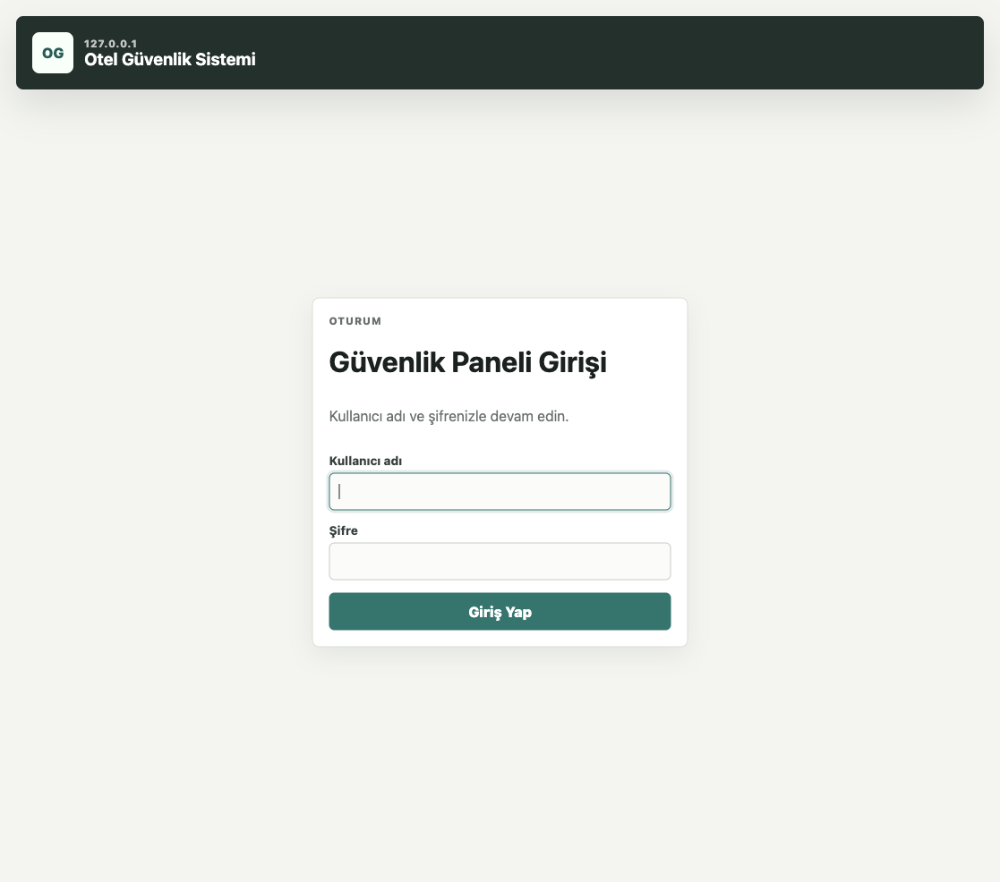

1. Kullanici adi alanina size verilen kullanici adini yazin.
2. Sifre alanina sifrenizi yazin.
3. `Giris Yap` butonuna basin.

Yetkiniz hangi panellere aciksa menude yalnizca o panelleri gorursunuz. Kapali bir panele link ile gitmeye calisirsaniz sistem yetki hatasi verir.

## 2. Canli Panel

Canli panel, guvenlik ekibinin en cok kullanacagi ana ekrandir. Guncel girisler, bekleyen cikislar, sure asimi ve kara liste uyarilari bu ekrandan takip edilir.

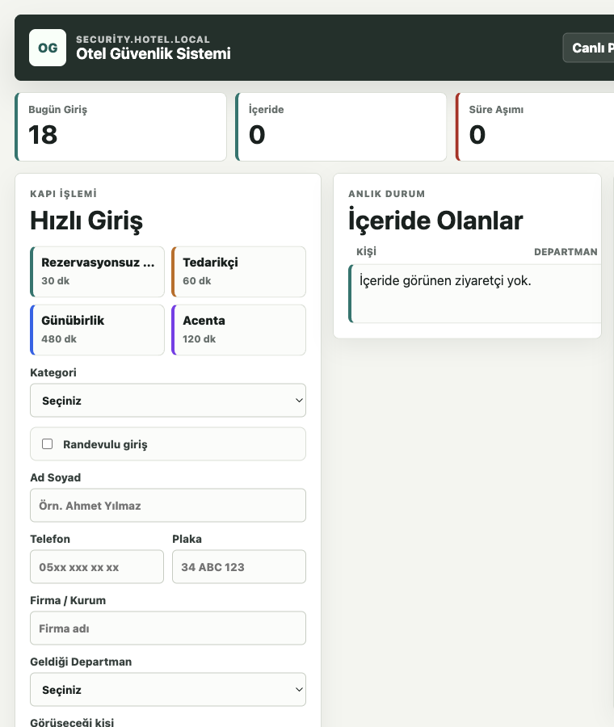

### Giris Kaydi Olusturma

1. Ad soyad alanina gelen kisinin adini yazin.
2. Daha once kayitli bir kisi ise sistem oneriler getirir.
3. Kategori secin.
4. Gerekirse departman, telefon, plaka ve not alanlarini doldurun.
5. Randevulu veya randevusuz bilgisini isaretleyin.
6. `Giris Kaydet` ile kaydi tamamlayin.

### Cikis Kaydi Olusturma

1. Canli listede ilgili kisiyi bulun.
2. `Detay` ile telefon ve not bilgilerini kontrol edebilirsiniz.
3. `Cikis` butonuna bastiginizda sistem emin misiniz diye sorar.
4. Onay verdiginizde kayit cikis durumuna alinir.

### Kara Liste Uyarisi

Kara listede olan bir kisi giris yaparsa ekranda buyuk ve dikkat cekici uyari gorunur. Guvenlik gorevlisi uyariyi okuduktan sonra `Okudum` ile kapatir.

## 3. Yonetim Ana Ekrani

Yonetim ana ekrani, sistemdeki tum ayar ve raporlama panellerine ulasim saglar.

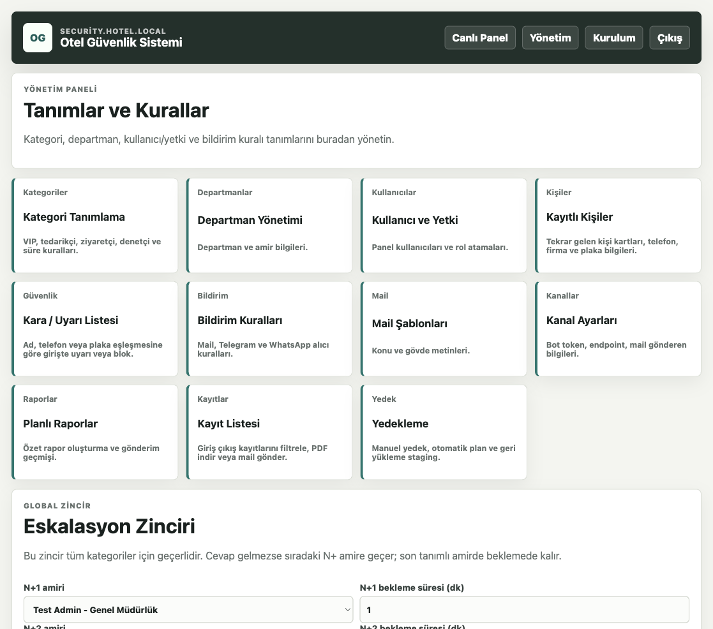

Bu ekranda her kullanici sadece yetkili oldugu panelleri gorur. Ornegin guvenlik gorevlisi icin `Kurulum` veya `Yonetim` kapali olabilir.

## 4. Kategoriler

Kategoriler, otele gelen kisi tiplerini tanimlamak icin kullanilir. Ornek kategoriler: Rezervasyonsuz Giris, Tedarikci, Gunubirlik, Acenta, Is Gorusmesi, Ziyaretci, Teknik Servis, Animasyon.

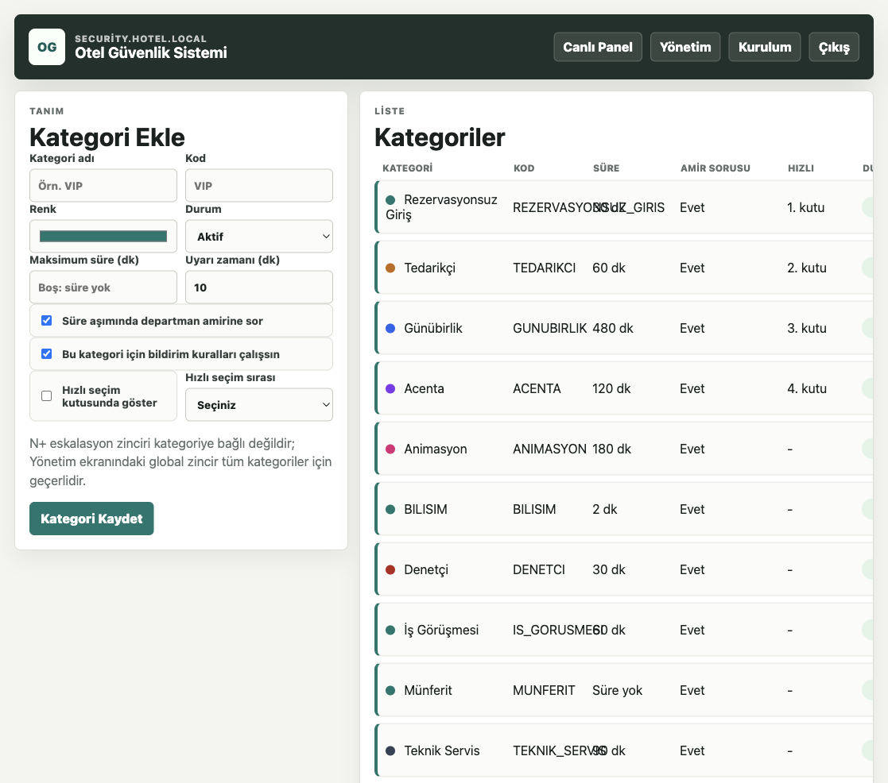

Kategori ekranindan:

1. Yeni kategori eklenebilir.
2. Uyari suresi belirlenebilir.
3. Hangi kategorilerin hizli secim kutularinda gorunecegi ayarlanabilir.
4. Mevcut kategoriler duzenlenebilir veya silinebilir.

Uyari suresi, kisinin iceride kalabilecegi sureyi ifade eder. Sure doldugunda sistem eskalasyon zincirine gore ilgili kisilere bildirim gonderir.

## 5. Kullanici ve Yetki Yonetimi

Bu ekran sistem kullanicilarini ve rollerini yonetmek icindir.

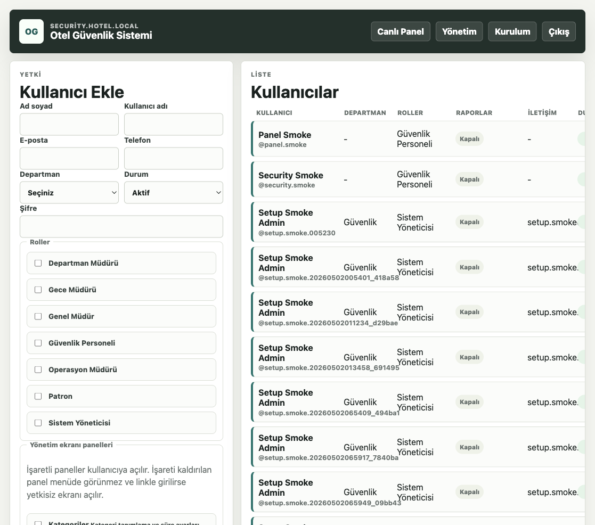

### Kullanici Ekleme

1. Ad soyad, kullanici adi, e-posta ve sifre bilgilerini girin.
2. Kullaniciya uygun rol veya rolleri secin.
3. Rapor gonderim tiklerini ihtiyaca gore acin:
   - Gunluk Rapor Gonder
   - Haftalik Rapor Gonder
   - Aylik Rapor Gonder
4. `Yonetim ekrani panelleri` bolumunden kullanicinin gorecegi panelleri isaretleyin.
5. `Kaydet` ile islemi tamamlayin.

### Panel Yetkileri

Bir panelin tiki kapaliysa:

- Kullanici menude o paneli gormez.
- Kullanici linki bilse bile o panele giremez.
- Sistem 403 yetki hatasi verir.

Bu yapi, guvenlik gorevlisinin sadece operasyon ekranlarini, yoneticilerin ise kendi sorumluluk alanlarini gormesi icin kullanilir.

## 6. Bildirim Kanallari

Telegram, WhatsApp ve Mail ayarlari bu ekrandan tanimlanir.

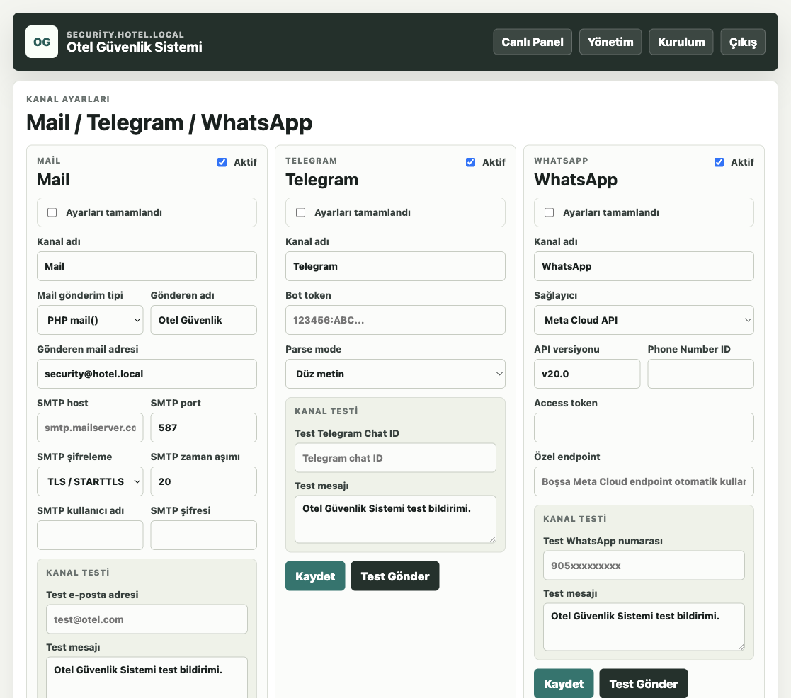

Bu ekranda:

1. Kanal tipi secilir.
2. Mail icin SMTP bilgileri girilir.
3. Telegram icin bot token ve chat bilgileri girilir.
4. WhatsApp icin servis ayarlari girilir.
5. Kanal kaydedildikten sonra test gonderimi yapilir.

Canli kullanimdan once her kanal mutlaka test edilmelidir.

## 7. Bildirim Kurallari

Bildirim kurallari, hangi olayda kime ve hangi kanaldan bildirim gidecegini belirler.

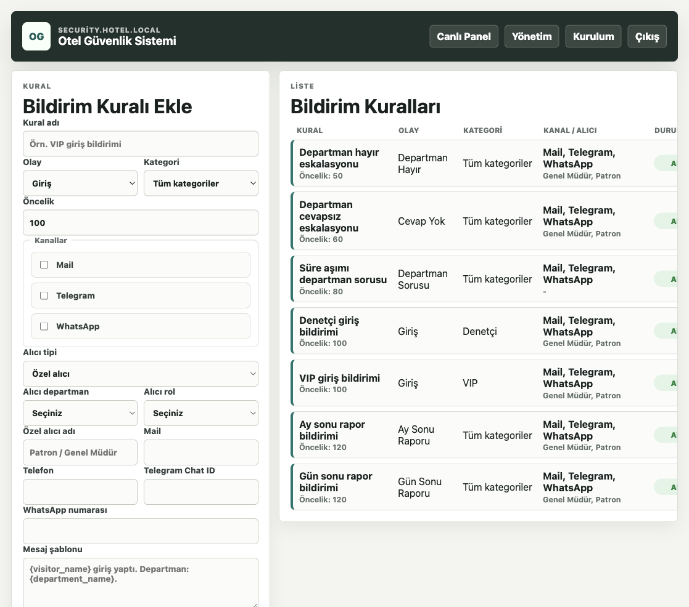

Ornek kullanim:

1. Bir kategori icin giris bildirimi tanimlanir.
2. Sure asimi durumunda eskalasyon zinciri devreye girer.
3. Ilk amir cevap vermezse sistem bekleme suresinden sonra ikinci amire gecer.
4. Son amirde kalacak sekilde zincir devam eder.

Mail ve Telegram mesajlarinda `Evet` / `Hayir` aksiyonlari kullanilarak durum bildirimi alinabilir.

## 8. Mail Sablonlari

Mail sablonlari, giden e-postalarin daha anlasilir ve standart olmasini saglar.

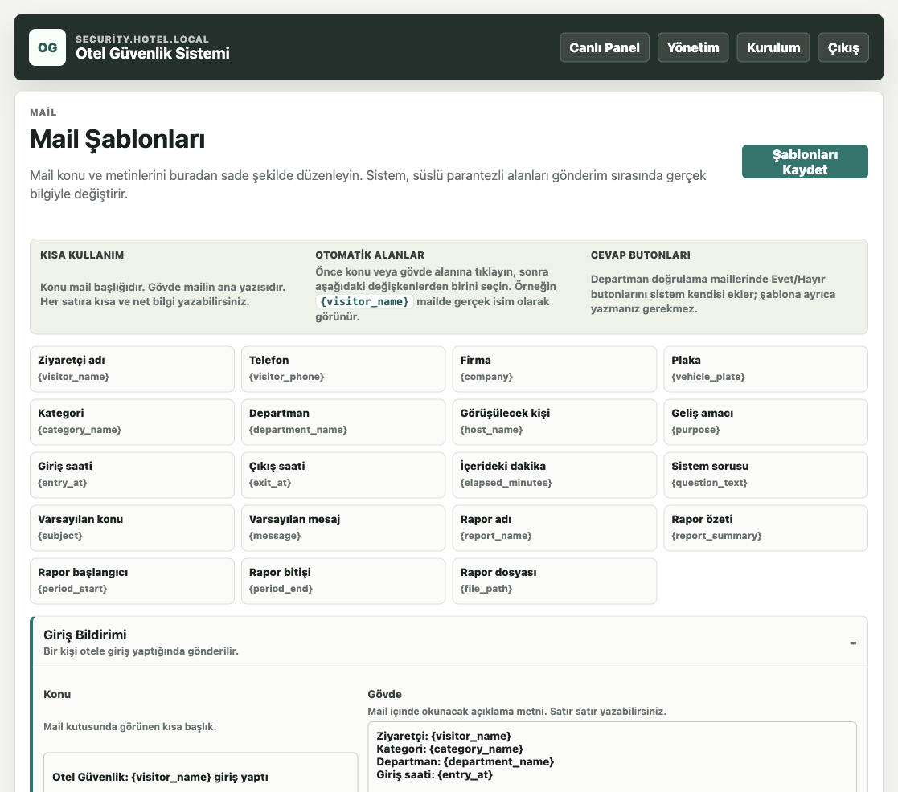

Basic kullanicilar icin alan aciklamalari eklenmistir. Sablonlarda degiskenler kullanilarak kisi adi, kategori, departman, giris saati ve sure asimi gibi bilgiler otomatik doldurulur.

## 9. Kayit Listesi ve PDF Gonderimi

Kayit listesi, gecmis giris-cikis kayitlarini filtrelemek ve raporlamak icindir.

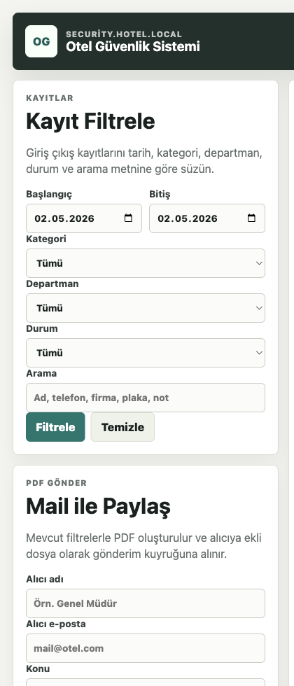

Bu ekrandan:

1. Tarih, kategori, departman veya durum filtresi yapabilirsiniz.
2. Kayitlari inceleyebilirsiniz.
3. PDF rapor olusturabilirsiniz.
4. PDF raporu mail ile gonderebilirsiniz.
5. Uygun yetki varsa kisi kara listeye alinabilir.

## 10. Planli Raporlar

Gunluk, haftalik ve aylik otomatik rapor gonderimleri bu ekrandan yonetilir.

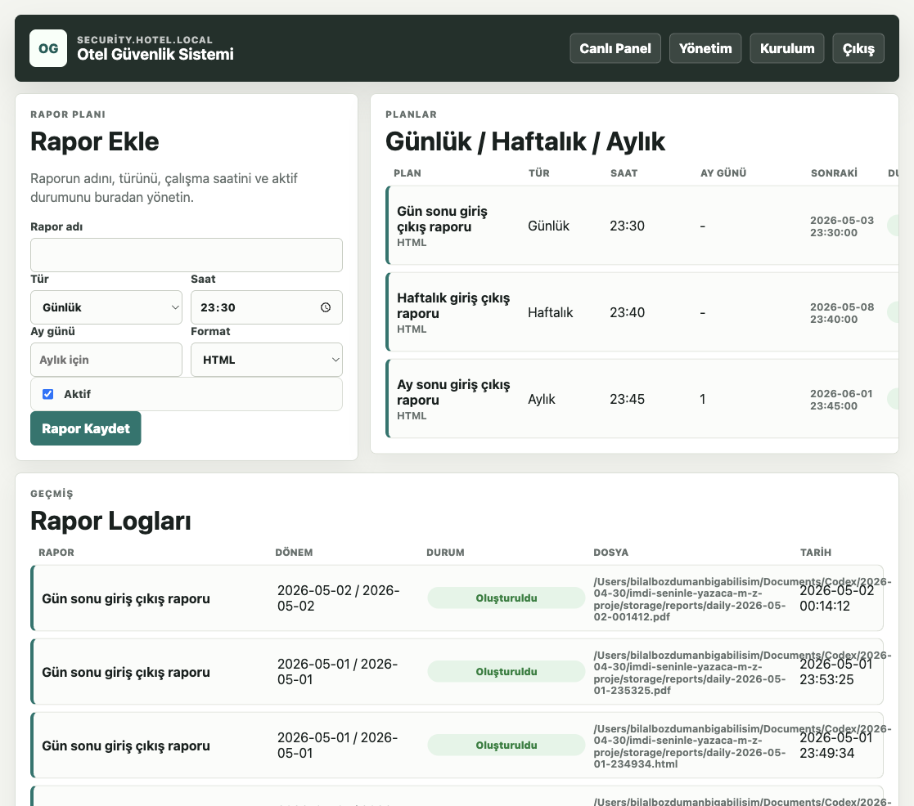

Kullanici kartinda rapor tikleri acildiysa sistem ilgili zamanlarda raporu otomatik gonderir. Manuel rapor gonderimi icin de bu panel kullanilir.

## 11. Kara Liste ve Uyari Listesi

Kara liste, otele girisi riskli veya dikkat gerektiren kisileri takip etmek icin kullanilir.

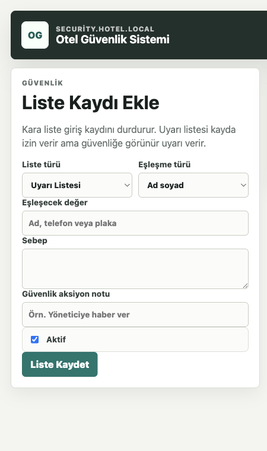

Kullanim:

1. Kisi bilgisi eklenir.
2. Uyari tipi secilir.
3. Not girilir.
4. Kisi tekrar giris yaptiginda canli panelde buyuk uyari acilir.

Kayit listesindeki kisiler de tek tusla kara listeye alinabilir.

## 12. Yedekleme

Yedekleme ekrani sistemin dosya ve veritabanini korumak icin kullanilir.

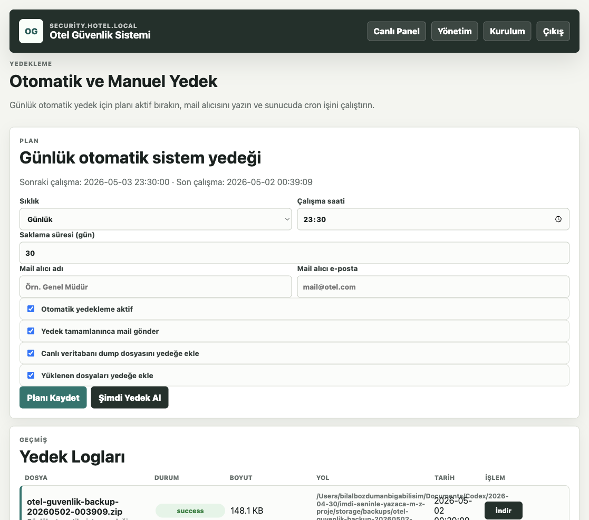

V1 icinde:

1. Otomatik yedekleme ayarlanabilir.
2. Gunluk yedek mail olarak gonderilebilir.
3. Yedek gecmisinden dosya indirilebilir.
4. Gerekirse yedekten geri donus yapilabilir.

Yedeklerin calistigi duzenli olarak kontrol edilmelidir.

## 13. Kurulum Sihirbazi

Kurulum sihirbazi, sistemi ilk kez canliya alirken kullanilir.

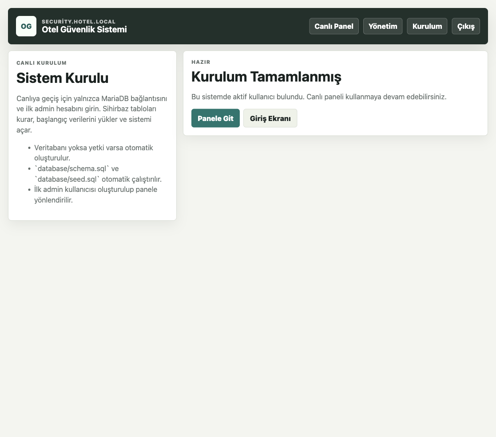

Kurulumda yalnizca:

1. SQL host, port, veritabani adi, kullanici adi ve sifre girilir.
2. Ilk admin kullanicisi tanimlanir.
3. Sistem tablo kurulumunu otomatik yapar.
4. Kurulum bitince panel acilir.

Sistem kuruluysa bu ekran kurulumun tamamlandigini gosterir. Canli sistemde kurulum yetkisi sadece yetkili yoneticilerde olmalidir.

## 14. Gunluk Operasyon Akisi

Guvenlik gorevlisi icin onerilen gunluk akistem:

1. Sisteme giris yap.
2. Canli paneli acik tut.
3. Gelen kisi icin giris kaydi olustur.
4. Kara liste uyarisi varsa amire bilgi ver.
5. Kisi ayrildiginda cikis kaydi olustur.
6. Sure asimi uyarilarini takip et.
7. Gun sonunda kayit listesini kontrol et.

## 15. Yonetici Kontrol Listesi

Yoneticiler icin temel kontrol listesi:

1. Kategoriler dogru mu?
2. Departmanlar ve amirler dogru mu?
3. Kullanici rolleri ve panel yetkileri dogru mu?
4. Bildirim kanallari test edildi mi?
5. Eskalasyon zinciri dogru sirada mi?
6. Mail sablonlari anlasilir mi?
7. Rapor alicilari dogru mu?
8. Yedekleme calisiyor mu?

## 16. Yetki Mantigi

V1'de yetkiler iki katmanlidir:

1. Rol yetkisi: Patron, genel mudur, operasyon muduru, gece muduru, guvenlik gibi genel yetki yapisi.
2. Kullanici panel yetkisi: Kullanici bazinda hangi yonetim panellerinin acik veya kapali oldugu.

Kullanici panel yetkisi kapaliysa, rol genel olarak yetkili olsa bile panel kapatilabilir. Bu nedenle yeni kullanici acarken panel tikleri mutlaka kontrol edilmelidir.

## 17. Onemli Notlar

- Canliya alinacak her yeni surum icin surum adi ayrica belirtilmelidir.
- V1 sonrasindaki gelistirmeler once test ortaminda denenmelidir.
- DB degisikligi gerekiyorsa canliya gecmeden once ayrica onay alinmalidir.
- Bildirim, rapor ve yedekleme gibi otomatik islerin calismasi icin sunucuda ilgili cron gorevleri aktif olmalidir.

