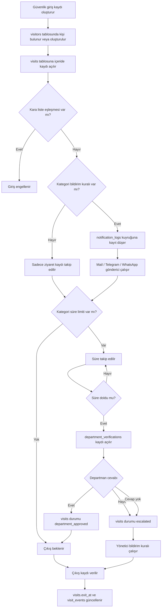

# MariaDB Veritabanı Şeması

Bu bölüm, otel güvenlik giriş-çıkış sisteminin ilk gerçek veritabanı temelidir. Şema yalnızca mevcut giriş/çıkış ekranını değil, sonraki modülleri de taşıyacak şekilde hazırlandı.

## Dosyalar

- `database/schema.sql`: MariaDB tablo yapıları, indeksler ve ilişkiler.
- `database/seed.sql`: Başlangıç rolleri, yetkiler, departmanlar, kategoriler, bildirim kanalları, rapor planları ve yedek işi.

## Kurulum Sırası

```sql
SOURCE database/schema.sql;
SOURCE database/seed.sql;
```

Komut satırından örnek:

```bash
mysql -u root -p < database/schema.sql
mysql -u root -p hotel_security < database/seed.sql
```

## Ana Tablolar

| Tablo | Amaç |
| --- | --- |
| `app_settings` | Kurulum sihirbazı, domain, logo ve sistem ayarları |
| `roles`, `permissions`, `role_permissions`, `user_roles` | Kullanıcı ve yetki yönetimi |
| `users` | Panel kullanıcıları ve rapor gönderim tercihleri |
| `departments` | Departmanlar ve departman amirleri |
| `visitor_categories` | VIP, tedarikçi, ziyaretçi, denetçi gibi kategoriler ve süre kuralları |
| `visitors` | Tekil ziyaretçi kartı ve tekrar gelen kişi hafızası |
| `watchlist_entries` | Kara liste ve uyarı listesi eşleşme kayıtları |
| `visits` | Giriş, çıkış, randevulu/randevusuz bilgisi, süre aşımı ve eskalasyon ana kaydı |
| `visit_events` | Ziyaret hareket geçmişi |
| `department_verifications` | Süre aşımında departman amirine giden soru ve cevap |
| `notification_channels` | Mail, Telegram, WhatsApp kanal ayarları |
| `notification_rules` | Hangi olayda kime hangi kanaldan bildirim gideceği |
| `notification_logs` | Gönderilen veya hata alan bildirimlerin ve PDF eklerinin kaydı |
| `report_schedules`, `report_recipients`, `report_logs` | Günlük, haftalık ve aylık rapor altyapısı |
| `backup_jobs`, `backup_logs`, `restore_logs` | Otomatik yedekleme ve yedekten geri dönme |
| `audit_logs` | Yönetim paneli işlem geçmişi |

## Temel Akış



## Sonraki Kodlama Adımı

Bu şemadan sonra ikinci adım PHP proje iskeletidir:

- `.env` / config yapısı
- PDO MariaDB bağlantısı
- login ekranı
- yetki kontrol middleware'i
- güvenlik panelinin `visitors` ve `visits` tablolarına bağlanması
